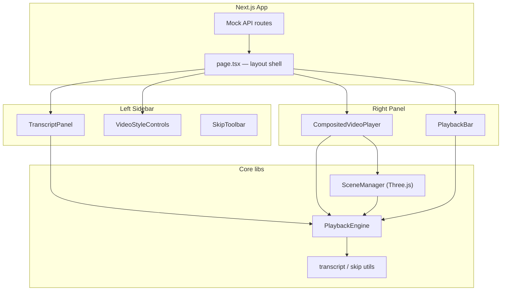

# Trupeer Video Player — Implementation Plan

> **Purpose:** Senior-level blueprint for building the assignment: a composited Three.js video player with a synced, skippable transcript sidebar.  
> **Stack:** Next.js 16 (App Router) · TypeScript · Tailwind CSS v4 · shadcn/ui · Three.js  
> **Assets:** `requirements/background.jpg`, `requirements/transcript.json`, video file (TBD — not in repo yet)

---

## 1. Executive Summary

We are building a **single-page creative video player** where:

1. A **background image** and **video** are composited on a **Three.js canvas** (not a plain `<video>` tag in the layout).
2. A **left sidebar** shows a word-level transcript, style controls (padding / rounding), and skip UX.
3. A **bottom playback bar** provides play/pause and scrubbing.

The hardest engineering problems are **keeping transcript sync accurate**, **skip-range playback logic**, **real-time Three.js styling (padding + border radius)**, and **avoiding React re-renders during playback** while still updating the UI smoothly.

---

## 2. Requirements Matrix

| Area | Requirement | Priority |
|------|-------------|----------|
| Layout | Single page: left sidebar + right player panel | Must |
| Player | Three.js canvas: background + centered video | Must |
| Player | Self-contained reusable component | Must |
| Transcript | Full transcript from word-level JSON | Must |
| Transcript | Highlight word at current playback time | Must |
| Transcript | Select text → skip (strikethrough, not played, unskip) | Must |
| Controls | Padding slider → real-time video padding on canvas | Must |
| Controls | Rounding slider → real-time border radius on video | Must |
| Playback | Play / Pause | Must |
| Playback | Seekable timeline reflecting `currentTime` | Must |
| Bonus | Click word → seek to timestamp | Should |
| Bonus | Performance optimizations for long videos | Should |
| Bonus | Mock API for transcript / media metadata | Should |
| UI | Clean, modern, close to reference design | Must |
| Arch | Playback must not cause unnecessary React re-renders | Must |
| Deliverable | Hosted deploy (Vercel) | Must |
| Interview | Be ready to discuss MP4 export approach | Prep |

---

## 3. Reference Design Analysis

From `requirements/assignment.docx` (embedded reference screenshot):

```
┌─────────────────────┬──────────────────────────────────────────┐
│  Script             │                                          │
│  ┌───────────────┐  │     ┌─────────────────────────────┐      │
│  │ transcript    │  │     │  gradient / scene frame     │      │
│  │ yellow active │  │     │   ┌───────────────────┐       │      │
│  │ word highlight│  │     │   │   video (dark)    │       │      │
│  └───────────────┘  │     │   └───────────────────┘       │      │
│  [Skip] button        │     └─────────────────────────────┘      │
│                     │         (dark workspace background)        │
│  Padding  [====] 32 │                                          │
│  Rounding [====] 32 │                                          │
├─────────────────────┴──────────────────────────────────────────┤
│  (▶)  00:03 / 02:45    ●━━━━━━━━○────────────────  timeline    │
└──────────────────────────────────────────────────────────────────┘
```

**Visual tokens to match:**

| Token | Value / note |
|-------|----------------|
| Sidebar | White / light surface, ~320–380px width |
| Workspace | Dark charcoal (`#1a1a1a`–`#0f0f0f`) behind canvas |
| Active word | Light yellow highlight (`bg-yellow-100` / `#FEF9C3`) |
| Accent | Blue for play button, slider thumb, timeline playhead |
| Sliders | Label + icon + track + numeric value (default ~32) |
| Canvas frame | Large rounded rect; video inset with padding |
| Typography | Inter / Geist, 14–15px body |

**Provided background (`background.jpg`):** Bright blue grid with colorful blob shapes at edges. The video sits centered in the “clear” middle area — padding controls how much of that background shows around the video.

**Note:** Reference mock uses a gradient frame; assignment inputs use `background.jpg`. We composite **the provided image** as the scene background and treat padding/rounding as properties of the **video plane**, not the reference gradient.

---

## 4. Provided Data

### 4.1 Transcript (`requirements/transcript.json`)

```ts
interface Word {
  text: string;
  start: number;   // seconds
  end: number;
  type: "word" | "spacing";
  logprob?: number;
}

interface Transcript {
  text: string;
  words: Word[];
}
```

**Stats (approximate):**

- ~8,200 tokens total (~1,300 `type: "word"` entries)
- Duration: **~200.4s** (last word ends at `200.42`)
- Includes `spacing` tokens — UI should render words + spaces, but **highlight/skip/seek only apply to `type: "word"`**

**Action item:** File has a **trailing comma** before closing `}` (invalid JSON). Fix during ingest (parser tolerant of trailing comma, or normalize in `scripts/fix-transcript.ts` once).

### 4.2 Background

- Copy to `public/assets/background.jpg` (or serve via mock API URL).

### 4.3 Video

- **Not present in `requirements/` yet.** Plan assumes `public/assets/video.mp4` (or URL from mock API).
- Use same duration as transcript (~200s) for timeline max.

---

## 5. Architecture Overview

### 5.1 Core principle: separate **decoding**, **rendering**, and **React UI**

```
┌─────────────────────────────────────────────────────────────────┐
│                     PlaybackEngine (non-React)                   │
│  HTMLVideoElement (hidden) ──texture──► Three.js render loop    │
│       ▲                              │                           │
│       │ seek / play / pause          │ RAF (~60fps)              │
│       │ skip logic                   ▼                           │
│  currentTime (ref)              Canvas display                   │
└───────────────┬─────────────────────────────────────────────────┘
                │ throttled snapshots (~8–10 Hz)
                ▼
┌─────────────────────────────────────────────────────────────────┐
│              React UI (sidebar + controls)                       │
│  transcript highlight · timeline · sliders · skip state          │
└─────────────────────────────────────────────────────────────────┘
```

**Why:** Assignment explicitly requires playback not to trigger unnecessary React re-renders. The video element’s `timeupdate` fires ~4×/sec; Three.js runs on `requestAnimationFrame`. React should subscribe to a **throttled** “display time” for UI only.

### 5.2 High-level module diagram



---

## 6. Tech Stack & Dependencies

| Package | Role |
|---------|------|
| `three` | WebGL scene, textures, shaders |
| `zustand` | External store with fine-grained selectors (optional but clean) |
| shadcn: `slider`, `button`, `scroll-area`, `tooltip` | Sidebar + playback UI |
| `lucide-react` | Icons (play, skip, padding, radius) |

**Intentionally not using `@react-three/fiber` for the player core** — plain Three.js inside `useEffect` + imperative API gives tighter control over re-renders and a clearer “drop-in” component contract. R3F can be revisited if ergonomics win over control.

---

## 7. Folder Structure

```
src/
├── app/
│   ├── page.tsx                      # Two-column layout, data fetching
│   ├── layout.tsx
│   └── api/
│       ├── transcript/route.ts       # GET → Transcript JSON
│       └── media/route.ts            # GET → { videoUrl, backgroundUrl, duration }
│
├── components/
│   ├── layout/
│   │   └── EditorShell.tsx           # Sidebar + main grid
│   │
│   ├── player/
│   │   ├── CompositedVideoPlayer.tsx # ★ Reusable public API
│   │   ├── PlaybackBar.tsx
│   │   └── types.ts
│   │
│   ├── sidebar/
│   │   ├── TranscriptPanel.tsx
│   │   ├── TranscriptWord.tsx
│   │   ├── SkipToolbar.tsx
│   │   └── VideoStyleControls.tsx
│   │
│   └── ui/                           # shadcn primitives
│
├── lib/
│   ├── playback/
│   │   ├── PlaybackEngine.ts         # ★ Single source of truth
│   │   ├── types.ts
│   │   └── events.ts                 # Tiny pub/sub for subscribers
│   │
│   ├── transcript/
│   │   ├── types.ts
│   │   ├── normalize.ts              # Parse JSON, index words
│   │   ├── sync.ts                   # time → active word index
│   │   └── skip.ts                   # ranges, strike state, seek map
│   │
│   └── three/
│       ├── SceneManager.ts           # init, resize, dispose
│       ├── createBackgroundMesh.ts
│       ├── createVideoMesh.ts        # padding + rounded shader
│       └── shaders/
│           └── roundedVideo.glsl.ts
│
├── hooks/
│   ├── usePlayback.ts                # subscribe to engine (throttled)
│   └── useTranscript.ts              # derived highlight + skip UI
│
└── types/
    └── index.ts

public/
└── assets/
    ├── background.jpg                # copied from requirements/
    └── video.mp4                     # user-provided
```

---

## 8. Data Models

### 8.1 Normalized transcript (internal)

```ts
interface NormalizedWord {
  id: number;              // stable index for React keys
  text: string;
  start: number;
  end: number;
  charStart: number;       // offset in full plain text
  charEnd: number;
}

interface NormalizedTranscript {
  fullText: string;
  words: NormalizedWord[];
  duration: number;        // max(end)
}
```

Build once after API fetch. Filter out `type !== "word"` for indexing; keep spacing tokens only for rendering if we render from `words[]` directly.

### 8.2 Skip ranges

```ts
interface SkipRange {
  id: string;
  start: number;           // seconds (inclusive)
  end: number;             // seconds (exclusive)
  wordIds: number[];       // for strikethrough UI
}
```

Merged on overlap when user adds multiple selections.

### 8.3 Player style (reactive, low frequency)

```ts
interface VideoStyle {
  padding: number;         // 0–64 px (or 0–100), default 32
  borderRadius: number;    // 0–48 px, default 32
}
```

### 8.4 Media metadata (mock API)

```ts
interface MediaMetadata {
  videoUrl: string;
  backgroundUrl: string;
  duration: number;
  title?: string;
}
```

---

## 9. `CompositedVideoPlayer` — Reusable Component API

```tsx
interface CompositedVideoPlayerProps {
  videoSrc: string;
  backgroundSrc: string;
  engine: PlaybackEngine;           // shared instance OR created internally
  padding?: number;
  borderRadius?: number;
  className?: string;
}

// Imperative handle (optional)
interface CompositedVideoPlayerHandle {
  getCanvas: () => HTMLCanvasElement;
  getSceneManager: () => SceneManager;
}
```

**Contract:**

- Owns canvas + Three.js lifecycle (init, resize observer, dispose).
- Reads `padding` / `borderRadius` from props but applies via `SceneManager` without remounting scene.
- Does **not** own transcript state.
- Exported from `components/player/index.ts` for clean imports.

---

## 10. Three.js Implementation

### 10.1 Scene setup

1. **Renderer:** `WebGLRenderer` with `alpha: false`, `antialias: true`, pixel ratio capped at `2`.
2. **Camera:** `OrthographicCamera` fitted to canvas aspect — simplifies “fit background + center video” math.
3. **Background mesh:** Full-viewport plane with `background.jpg` texture, `MeshBasicMaterial`.
4. **Video mesh:** Plane with `VideoTexture` from hidden `<video>` element.

### 10.2 Video positioning (padding)

- Define **layout box** = canvas logical size.
- **Video display size** = layout box minus `2 * padding` (clamp so video never inverts).
- Center video plane at `(0, 0)` in orthographic space.
- On padding change: update plane scale/position only (no texture reload).

### 10.3 Border radius (rounding)

Use a **custom fragment shader** on the video material:

- Uniform `u_radius` (0–0.5 in UV space).
- Discard fragments outside rounded rect (SDF or corner distance).
- Alternative fallback: render video to offscreen canvas with `roundRect` clip — simpler but costlier; shader preferred for real-time slider.

### 10.4 Render loop

```ts
function tick() {
  if (videoTexture) videoTexture.needsUpdate = true;
  if (engine.isPlaying) {
    engine.syncTimeFromVideo();
    engine.applySkipLogic();      // may seek video forward
  }
  renderer.render(scene, camera);
  rafId = requestAnimationFrame(tick);
}
```

Pause loop when tab hidden (`document.visibilitychange`) — bonus optimization.

### 10.5 Hidden video element

- `document.createElement("video")` or ref to off-DOM `<video preload="metadata" playsInline>`.
- `crossOrigin` if assets on CDN.
- Engine owns play/pause/seek; Three.js only reads frames.

---

## 11. PlaybackEngine Design

Central class (~250–350 LOC). **Not a React hook** — instantiated once per page.

### 11.1 Responsibilities

| Method / property | Description |
|-------------------|-------------|
| `play()` / `pause()` / `toggle()` | Control hidden video |
| `seek(time: number)` | Clamp to `[0, duration]`, then map through skip ranges |
| `getCurrentTime()` | Read from video ref |
| `getDuration()` | `video.duration` or metadata fallback |
| `setSkipRanges(ranges)` | Updates internal merged ranges |
| `setPlaybackRate(1)` | Optional; keep at 1 for assignment |
| `subscribe(listener)` | Returns unsubscribe; emits throttled state |
| `dispose()` | Cancel RAF, pause, remove listeners |

### 11.2 Skip playback logic

```ts
function getPlayableTime(t: number, skips: SkipRange[]): number {
  // If t falls inside any skip range, return range.end (jump forward)
  for (const r of skips) {
    if (t >= r.start && t < r.end) return r.end;
  }
  return t;
}
```

On every RAF while playing:

1. Read `video.currentTime`.
2. If inside skip range → `video.currentTime = range.end` (silent seek).
3. Emit throttled UI update.

On **manual seek** (timeline or word click):

- If target lands in skip range → snap to `range.end` (or block seek into skip — product choice: **snap forward** matches “not played”).

### 11.3 Throttled UI emissions

```ts
const UI_EMIT_INTERVAL_MS = 100; // ~10 Hz for transcript + timeline
```

Emit: `{ currentTime, isPlaying, activeWordId }`.

---

## 12. Transcript UI

### 12.1 Rendering strategy

**Option A (recommended):** Single `contentEditable={false}` container with `<span data-word-id>` per word + spacing text nodes.

- ~1,300 word spans + spacing — acceptable for ~200s video.
- If perf issues: virtualize by paragraph chunks (split every N words).

### 12.2 Active word highlight

- `activeWordId` from engine subscriber.
- Class: `bg-yellow-100 rounded-sm` on active span.
- `scrollIntoView({ block: "nearest" })` when active word changes.

### 12.3 Text selection → skip

1. User selects text in transcript panel.
2. On mouseup / selection change: map selection range → covered word IDs → time range `[min(start), max(end)]`.
3. Show **Skip** toolbar (reference: top-right of script block).
4. On confirm: `engine.setSkipRanges([...])` + mark words with `line-through opacity-60`.
5. **Unskip:** click struck word or “Unskip” on selection → remove range from store.

### 12.4 Click word to seek (bonus)

- `onClick` on word span → `engine.seek(word.start)`.
- Prevent seek if word is in skipped range (optional: allow seek but immediately jump past skip).

---

## 13. Sidebar Controls

### 13.1 Padding & Rounding sliders

- shadcn `Slider` + numeric readout (e.g. `32`).
- Store in React state **or** zustand `styleSlice` — changes are infrequent, so React re-render is fine here.
- Pass values to `CompositedVideoPlayer` → `SceneManager.updateStyle({ padding, borderRadius })`.

### 13.2 Defaults

Match reference: **32** for both.

---

## 14. Playback Bar

| Element | Behavior |
|---------|----------|
| Play/Pause | Toggle engine |
| Time label | `formatTime(current)` / `formatTime(duration)` |
| Timeline slider | `value={currentTime}`, `max={duration}`, onChange → seek |
| Tick marks | Optional 15s labels (nice-to-have from reference) |

**Important:** Slider uses throttled `currentTime` from hook, not raw video events.

While dragging: set `isScrubbing` flag on engine to avoid fighting skip logic until pointer up.

---

## 15. Mock API (Bonus)

### `GET /api/transcript`

- Read normalized `requirements/transcript.json` (or fixed copy in `public/data/`).
- Return `Transcript` with cache headers: `Cache-Control: public, max-age=3600`.

### `GET /api/media`

```json
{
  "videoUrl": "/assets/video.mp4",
  "backgroundUrl": "/assets/background.jpg",
  "duration": 200.42,
  "title": "Trupeer Demo"
}
```

### Client fetch (in `page.tsx` or server component)

```ts
const [transcript, media] = await Promise.all([
  fetch("/api/transcript").then(r => r.json()),
  fetch("/api/media").then(r => r.json()),
]);
```

Pass into client boundary via props — **no hardcoded URLs in components**.

---

## 16. State Management Summary

| State | Where | Update frequency |
|-------|--------|------------------|
| `currentTime`, `isPlaying` | PlaybackEngine + subscribers | Throttled ~10 Hz |
| `skipRanges` | Zustand or React context | Rare |
| `activeWordId` | Derived in `useTranscript` | Throttled |
| `padding`, `borderRadius` | React / zustand | Rare (slider drag) |
| Three.js objects | SceneManager refs | RAF, no React |

**Anti-pattern to avoid:** `useState` + `video.ontimeupdate` → `setCurrentTime` every frame.

---

## 17. Performance Optimizations

| Technique | Impact |
|-----------|--------|
| Hidden video + texture update only while playing | Reduces decode work when paused |
| Cap `devicePixelRatio` at 2 | Limits GPU fill on retina |
| Throttle React UI updates to ~10 Hz | Meets “no unnecessary re-renders” |
| `preload="metadata"` initially; full preload on user play | Faster first paint |
| Dynamic `import()` for `CompositedVideoPlayer` | Smaller initial JS bundle |
| Pause RAF when `document.hidden` | Saves battery |
| Merge skip ranges | O(n) skip checks stay small |
| `React.memo` on `TranscriptWord` | Only if profiling shows issues |
| Serve video from `public/` or CDN with range requests | Standard streaming |

**Long video note:** Transcript is ~200s, not hours — virtualization is **nice-to-have**, not day-one unless profiling demands it.

---

## 18. Implementation Phases

### Phase 0 — Project setup (0.5 day)

- [ ] Add dependencies: `three`, `zustand`
- [ ] Add shadcn: `slider`, `button`, `scroll-area`
- [ ] Copy `background.jpg` → `public/assets/`
- [ ] Add `video.mp4` to `public/assets/`
- [ ] Fix / normalize `transcript.json` (trailing comma)
- [ ] Add `PLAN.md` checklist tracking (optional)

### Phase 1 — Shell & mock API (0.5 day)

- [ ] `EditorShell` two-column layout matching reference
- [ ] `/api/transcript` + `/api/media`
- [ ] Server or client fetch wiring on home page
- [ ] Placeholder in player area

### Phase 2 — PlaybackEngine + hidden video (1 day)

- [ ] `PlaybackEngine` class with play/pause/seek
- [ ] Throttled subscriber pattern
- [ ] `PlaybackBar` hooked to engine
- [ ] Verify play/pause and scrub without Three.js

### Phase 3 — Three.js composited player (1.5 days)

- [ ] `SceneManager` with background texture
- [ ] Video texture + centered plane
- [ ] Padding updates in real time
- [ ] Rounded-corner shader
- [ ] `CompositedVideoPlayer` reusable wrapper + resize handling
- [ ] Dispose on unmount

### Phase 4 — Transcript panel (1 day)

- [ ] Normalize transcript
- [ ] Render word spans
- [ ] Active word highlight + auto-scroll
- [ ] Click word → seek (bonus)

### Phase 5 — Skip feature (1 day)

- [ ] Text selection → word range → `SkipRange`
- [ ] Strikethrough styling
- [ ] Skip toolbar UI
- [ ] Engine skip logic during playback + seek
- [ ] Unskip flow

### Phase 6 — Polish & performance (0.5 day)

- [ ] Match reference colors/spacing
- [ ] Dynamic import player
- [ ] Visibility pause
- [ ] Loading / error states
- [ ] Accessibility: keyboard space = play/pause, slider ARIA

### Phase 7 — Deploy & docs (0.5 day)

- [ ] `npm run build` clean
- [ ] Deploy to Vercel
- [ ] README: setup, env, architecture summary
- [ ] Prepare MP4 export talking points (below)

**Estimated total:** ~5–6 focused engineering days.

---

## 19. Testing Strategy

| Layer | What to test |
|-------|----------------|
| Unit | `normalizeTranscript`, `mergeSkipRanges`, `getPlayableTime`, `findActiveWordIndex` |
| Integration | Seek + skip: time inside range jumps to end |
| Manual | Highlight stays within ~100ms of audio |
| Manual | Padding/rounding sliders feel instant |
| Manual | Select → skip → strikethrough → video jumps over section |
| Manual | Unskip restores playback through section |
| Manual | Resize window → canvas scales correctly |
| Manual | Mobile: layout stacks or min-width scroll (define breakpoint) |

**Tooling:** Vitest for pure functions; no E2E required for assignment unless time permits (Playwright smoke test).

---

## 20. Deployment

1. Push to GitHub.
2. Vercel project → root `trupeer`.
3. Ensure `public/assets/video.mp4` is committed or hosted externally (if large, use Vercel Blob / S3 URL in `/api/media`).
4. Verify production build serves API routes and static assets.

---

## 21. MP4 Export — Interview Discussion (No Implementation)

Be prepared to explain **three tiers**:

### A. Client-side (canvas capture)

```
canvas.captureStream(30) + video.audio → MediaRecorder → WebM
→ remux to MP4 (ffmpeg.wasm) if MP4 required
```

**Pros:** No server. **Cons:** Quality limits, large files, browser codec variance, CORS on assets.

### B. Server-side (recommended for production)

- Headless Chromium / Puppeteer renders same Three.js scene frame-by-frame.
- Or **FFmpeg** composes: `background.jpg` + scaled/rounded video via `filter_complex` (geq/overlay), audio from source.
- Job queue (BullMQ) for long exports.

**Pros:** Consistent output, H.264/AAC. **Cons:** Infra cost.

### C. Remotion / Motion Canvas

- Reimplement scene as Remotion composition (React → video).
- Best if product already lives in React; keeps WYSIWYG.

**Pros:** Deterministic, scalable on Lambda. **Cons:** Rewrite render path.

### Architecture talking points

- **Single source of truth:** Same `padding`, `borderRadius`, `skipRanges` JSON drives both preview engine and export pipeline.
- **Frame clock:** Export steps at `1/fps` through **playable timeline** (skip ranges removed from clock).
- **Performance:** Parallel FFmpeg, GPU encoding, preview ≠ export resolution.

---

## 22. Risks & Mitigations

| Risk | Mitigation |
|------|------------|
| Video file missing | Blocker until added; use sample Big Buck Bunny temporarily for dev |
| Invalid transcript JSON | Tolerant parser + CI script |
| Rounded video shader bugs on some GPUs | Fallback to canvas clip path |
| Skip + scrub race conditions | `isScrubbing` flag on engine |
| 8k word spans slow React | Chunked rendering / virtualization |
| Large video git size | External URL in mock API |
| Audio/video desync on seek | Always seek video element; derive UI from video time |

---

## 23. Open Questions / Decisions

| # | Question | Proposed default |
|---|----------|------------------|
| 1 | Video asset location? | `public/assets/video.mp4` until user provides URL |
| 2 | Seek into skipped region? | Snap to end of skip range |
| 3 | Mobile layout? | Sidebar stacks above player below `md` breakpoint |
| 4 | Slider ranges? | Padding 0–80, radius 0–48 |
| 5 | Use R3F? | No — vanilla Three.js in player component |

---

## 24. Definition of Done

- [ ] Single page matches reference layout (sidebar + player + timeline)
- [ ] Three.js composites `background.jpg` + video with live padding/rounding
- [ ] `CompositedVideoPlayer` is reusable and documented
- [ ] Transcript highlights active word in sync with playback
- [ ] Skip selection works with strikethrough and playback jump
- [ ] Play/pause + timeline scrubbing work
- [ ] Mock API serves transcript + media metadata
- [ ] No per-frame React re-renders during playback (verified in React DevTools)
- [ ] Production build passes; app deployed to Vercel
- [ ] README with run instructions

---

## 25. Next Step

1. Add `video.mp4` to `requirements/` or `public/assets/`.
2. Confirm plan approval.
3. Start **Phase 0 → Phase 1** implementation in order above.

---

*Document version: 1.0 — generated from `requirements/assignment.docx`, `transcript.json`, `background.jpg`, and reference screenshot.*
